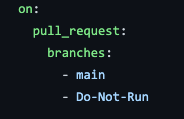

# Intro

**NOT** intended for production use. For demonstration purposes only 😊 .

A demo node express app to show off GitHub Actions CD capabilities by deploying to an Azure App Service.

This web app will allow you to search for any GitHub user by their handle!

Part of the GitHub Demo Day series! View Youtube recording [here](https://www.youtube.com/watch?v=pfnGHNYQcg0&ab_channel=GitHub) for a step-by-step walkthrough.

## Setup

1. Create an Azure App Service and App Service Plan to host your node express app
2. Under the App Service -> Settings: Configuration -> Set the Application Setting: `WEBSITE_NODE_DEFAULT_VERSION` to `10.0.0`
3. Create deployment slots in the App Service for your different enviroments
4. Download the Publish Profile for the respective deployment slots
5. Update `github/workflows` files with the correct `AZURE_WEBAPP_NAME`
6. Create environments secret `AZURE_WEBAPP_PUBLISH_PROFILE` for the correlating environments defined

## Run App Locally:

1. Fork/Clone Repo
2. Open in Codespaces or IDE of your choice
3. `npm install`
4. `npm run test`
5. `npm run dev`

## Triggering Actions for Azure Deployment

1. Create a new branch
2. Introduce new commits
3. For the specific .yml workflow to run, update the comments in the `on:` section to include the `main` branch

   - 
   - 

4. Create a pull request to the main branch
5. Check the Actions tab, Pull Request, and Environments page as the workflow runs!

## Reference Material

- [Environments - GitHub Docs](https://docs.github.com/en/free-pro-team@latest/actions/reference/environments)

- [Using the visualization graph - GitHub Docs](https://docs.github.com/en/free-pro-team@latest/actions/managing-workflow-runs/using-the-visualization-graph)

- [Deploy to App Service using GitHub Actions - Microsoft Docs](https://docs.microsoft.com/en-us/azure/app-service/deploy-github-actions?tabs=applevel)

- [Helpful Guide on createing a Node Express App](https://auth0.com/blog/create-a-simple-and-stylish-node-express-app/)

- [Continuous delivery with GitHub Actions - GitHub Universe 2020 YouTube](https://www.youtube.com/watch?v=36hY0-O4STg&t=10s&ab_channel=GitHub)

- [Welcome to Codespaces - GitHub Universe 2020 YouTube](https://www.youtube.com/watch?v=j5VQ8OlwbqI&ab_channel=GitHub)

## Feedback?

Open a discussion thread in this repo!

Participate in our Support Community for Code-to-Cloud:

- https://github.community/c/code-to-cloud/52
